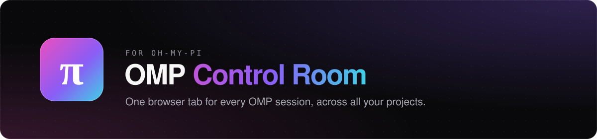
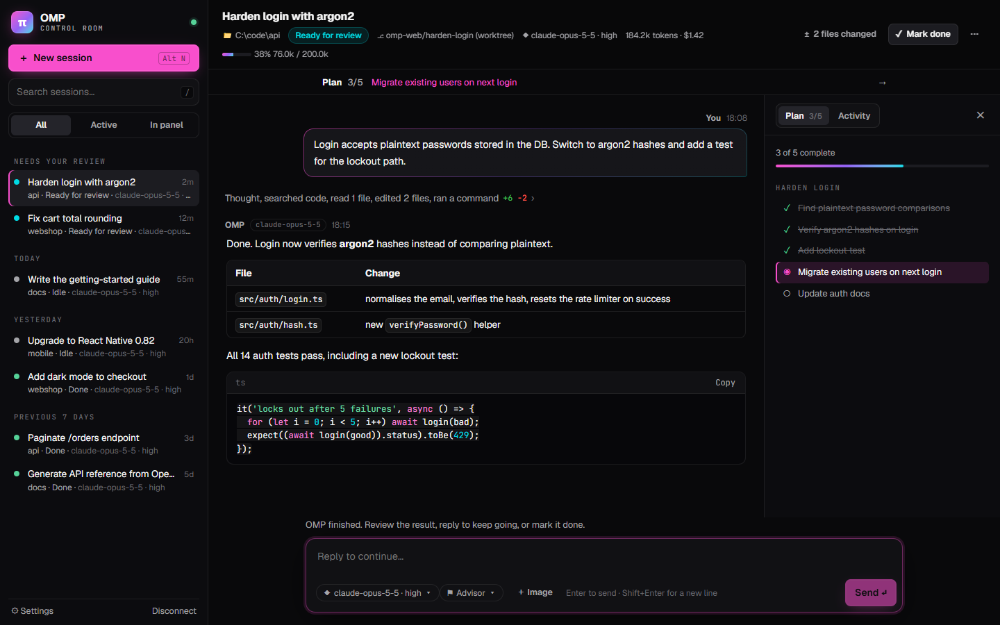
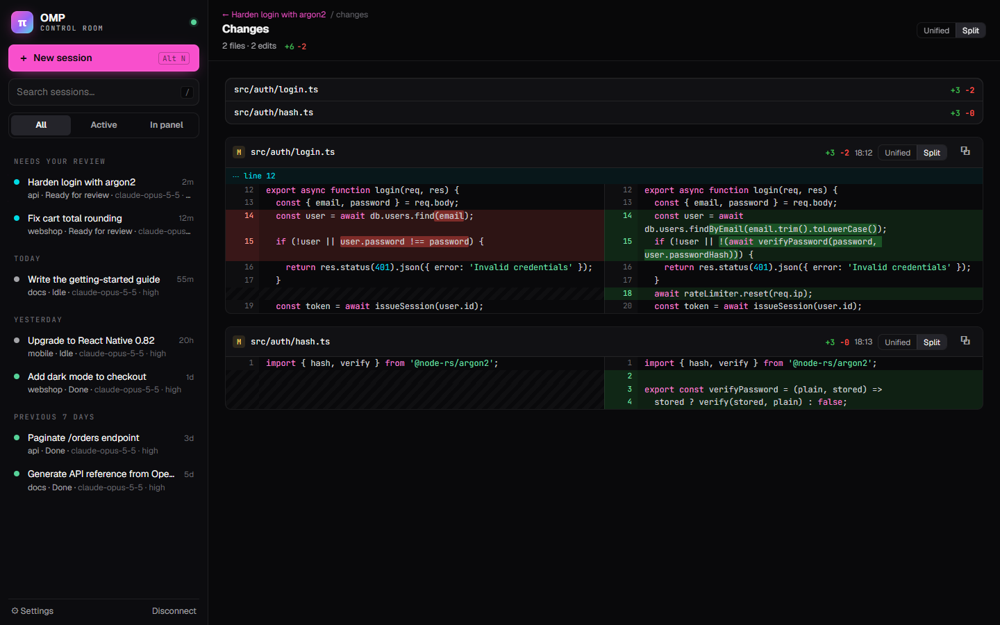
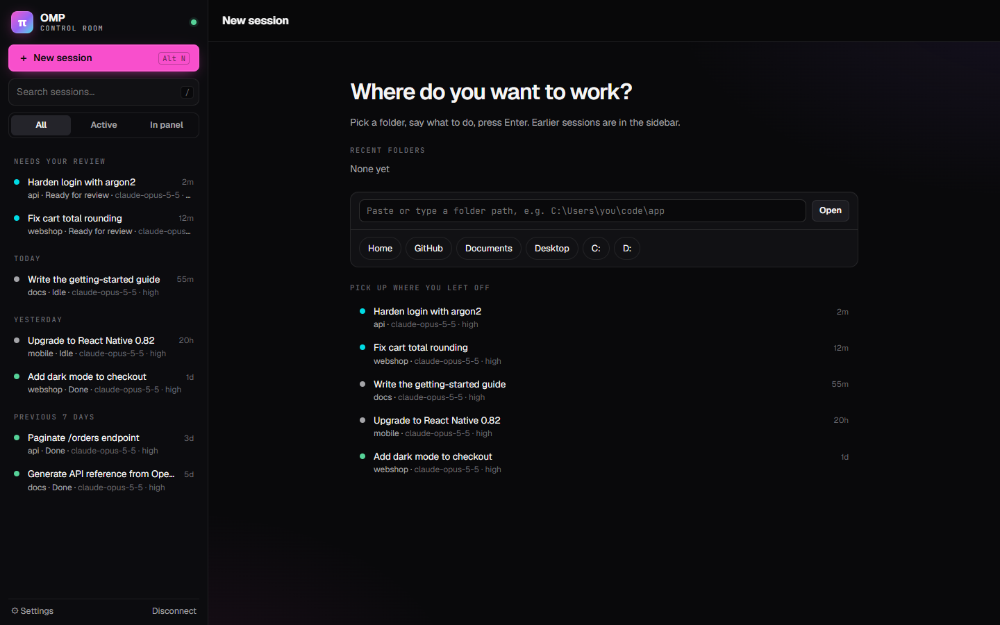

<p align="center"></p>

<p align="center">
  
  
  
</p>

**One browser tab for all your [oh-my-pi](https://github.com/can1357/oh-my-pi) sessions.** Run, watch and review OMP agents across many projects without juggling terminals. OMP itself stays unchanged.



<table>
  <tr>
    <td width="50%"></td>
    <td width="50%"></td>
  </tr>
  <tr>
    <td align="center"><sub>Review every change as a unified or split diff</sub></td>
    <td align="center"><sub>Start a session in any folder in two keystrokes</sub></td>
  </tr>
</table>

## Features

- **Every session in one sidebar**, including ones you started in a terminal, grouped by *Working now*, *Needs your review*, *Today* and older.
- **Readable conversations:** Markdown, tables and code blocks with copy. Tool calls and thinking fold into one activity summary.
- **GitHub-style diffs** with word-level highlights, in unified or split view.
- **Live plan and activity panel** for todos, subagents, background jobs and advisor transcripts.
- **Smart composer:** send, steer a running turn, queue follow-ups, attach images, and switch model or reasoning level.
- **Answer OMP's questions** (`ask` tool and extension prompts) directly in the browser.
- **Settings UI** for every `omp config` value and for plugins, plus one-click `omp update`.
- **Isolated git worktrees** so parallel sessions don't overwrite each other's files.

## Quick start

Requires **Node.js 22+** and a working OMP install (`omp --version` works and a model provider is configured).

```sh
node companion/server.mjs
```

On Windows you can double-click `start.bat` instead.

The dashboard opens in your browser, already connected. Press **Alt+N** (or click **New session**), pick a folder, type a prompt and press Enter. Keep the companion terminal open while you work.

## Good to know

- **Don't continue a session in the panel while it's still open in a terminal.** Both would write to the same file.
- **Worktrees:** tick **Isolated git worktree** when starting a session in a Git repo. You get an `omp-web/<id>` branch off HEAD. Uncommitted changes and dependencies are not copied. Worktrees are never merged or deleted automatically.
- **Where data lives:** `~/.omp-web/` holds `workspace.json`, managed sessions and worktrees. Sessions started normally also appear in OMP's own store, so `omp --resume` works.
- **Security:** the companion listens only on `127.0.0.1`. It uses a random per-launch token and checks Host and Origin. The HTTP API has no raw shell endpoint, but OMP keeps its usual tools and permissions.

## Configuration

| Variable | Default | Purpose |
| --- | --- | --- |
| `OMP_BIN` | `omp` | Path to OMP if it's not on PATH |
| `OMP_WEB_PORT` | `4545` | Companion port |
| `OMP_WEB_DATA_DIR` | `~/.omp-web` | Panel state, sessions and worktrees |
| `OMP_SESSIONS_DIR` | `<agent dir>/sessions` | OMP's native session store |
| `PI_CODING_AGENT_DIR` | `~/.omp/agent` | OMP agent directory (`config.yml`, `WATCHDOG.yml`) |
| `OMP_ALLOWED_ORIGINS` | none | Extra browser origins allowed to connect (see below) |
| `OMP_WEB_NO_OPEN` | unset | Don't open the browser on start |

### Hosted dashboard (optional)

The local dashboard is the most reliable option. To use the hosted one instead, allow its origin, then connect to `http://127.0.0.1:4545` with the printed token:

```sh
OMP_ALLOWED_ORIGINS=https://omp-control-room.ataberk-oztrk3.chatgpt.site node companion/server.mjs
```

Your browser may block HTTPS-to-localhost requests. If it does, use the local dashboard.

## Development

```sh
node --test "tests/*.test.mjs"
```

`companion/` is the Node server. `local-dist/` is the prebuilt dashboard, which you edit directly because the frontend source isn't in this repo. The companion speaks OMP's RPC protocol v1 (`--mode rpc-ui`) and needs no upstream fork.

**Not supported:** attaching to already-running terminal sessions, automatic Git merges, and custom extension TUIs beyond select, confirm, text and editor prompts.
